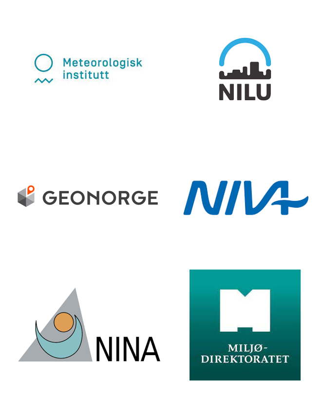
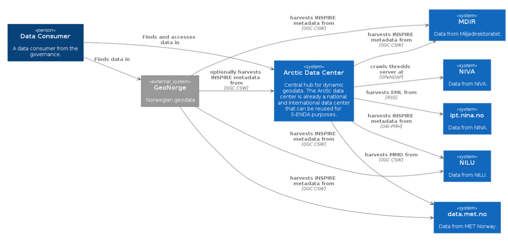

# S-ENDA - Satsning – ENhetlig DAtaforvalting

---
# About S-ENDA

- Project for coordination of dynamic geodata in Norway
- Part of a larger effort within the national geodata strategy (“Alt skjer et sted”), and relates to this strategy through Geonorge, which is developed and operated by the Norwegian Mapping Authority (“Kartverket”).
 
 

---

# Goal

- In particular, S-ENDA is responsible for measure 20 of the Norwegian geodata strategy: Establish a distributed, virtual data center for use and management of dynamic geodata.
- S-ENDA’s vision is that everyone, from professional users to the general public, should have easy, secure, and stable access to dynamic geodata.
- The FAIR principles constitute the governing principles of S-ENDA.

---

# System architecture

---

# Partners' job

- Ensure that the data center can offer a significant amount of dynamic geodata
- Adapt data infrastructure to the FAIR principles
- Contribute to the development of technical solutions
- Contribute to testing and quality assurance of the technical solutions
- Participate in the steering group and the reference and evaluation group 
 
_MET is responsible for leading the project and ensuring effective interaction._

---

# NIVA's contribution - infrastructure

- [Data Management Handbook](https://s-enda.github.io/DMH/)
- Set up a [Thredds](https://thredds.niva.no/thredds/catalog/catalog.html) server.  
     Supported services:
    - OPeNDAP 
    - CdmRemote
    - ISO
    - NCML
    - UDDC

--- 

# NIVA's contribution - datasets

  Timeseries published on Thredds
  - Msource inlet
  - Msource outlet
  -  Color Fantasy - Daily
  -  Color Fantasy NorSoop
  - SIOS

